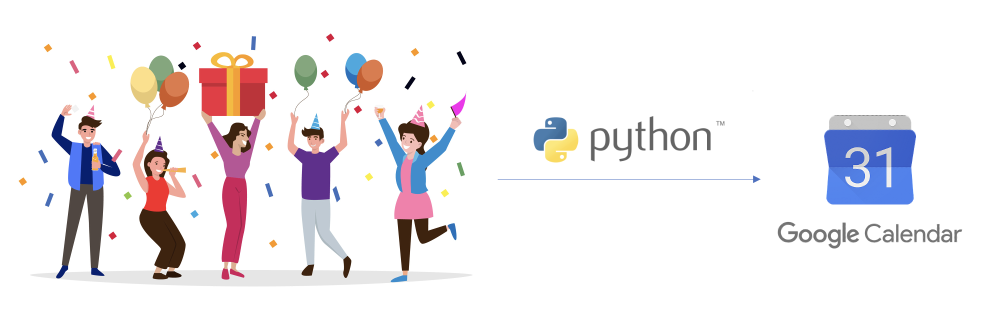

# Smart Birthdays
Do you have a large group of people where you find it difficult to keep a track of everyones birthday. Well, no more. Using Smart Birthdays, create a google calendar event for the individual members birthday and get a pop up notification and mail for the upcoming birthdays of your group members. This blocks the provided email id's calendar for the entire day, post their event acceptance. 

A simple usecase for smart-birthdays can be to, 
1. Get a popup notification about the member birthday at 11.50 PM (23.50) itself.
2. Get an email about the upcoming member birthday 24 hours ago before their birthdate.
3. Custom text, messages in the popup (Here, Instagram ID).

The notifications can be configured for the entire (team) who takes care of all the posts.

All you need is a 
- **Google ID**
- **Data of all the members in an excel file**
- **Python, a docker container can perhaps help and pip**
- **A few python dependencies**
- ✨  ***Patience to  follow the steps mentioned in this guide***  ✨  

### Steps

1. Go to Google Cloud - https://cloud.google.com/ and sign up with your Google ID.
2. Create a project with your desired name.
3. The official google documentation on how to use Google Workspace API using python can be accessed here - https://developers.google.com/calendar/api/quickstart/python 
4. Follow only steps mentioned below, from the above document
    - Enable the API
    - Configure the OAuth consent screen
    - Authorize credentials for a desktop application
    - Install the Google client library
5. Once done, refer to the sample excel file in the data folder, replace the sample content with some real data (birthdates, names and instagram ID's of your group members)
6. Run the app.py
